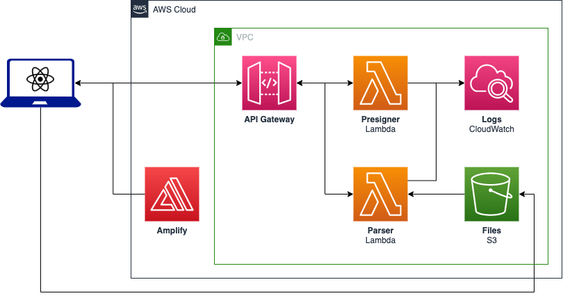
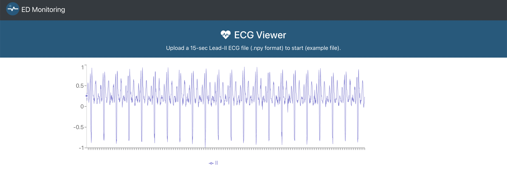

# Amplify Lambda Project Demo

A simple Amplify-hosted website that makes REST-calls to an API Gateway Lambda-backed backend system.

## Credentials

Set the AWS credentials as environment variables:

```
export AWS_ACCESS_KEY_ID="XXXXXXXX"
export AWS_SECRET_ACCESS_KEY="XXXXXXXX"
export AWS_SESSION_TOKEN="XXXXXXXX"
```

## Deployment

- Follow the instructions in `backend/README.md`
- Follow the instructions in `frontend/README.md`

## Architecture



## End Product



